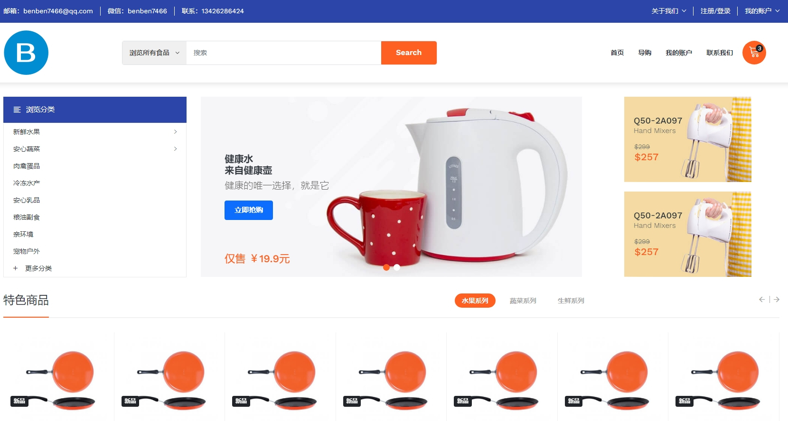
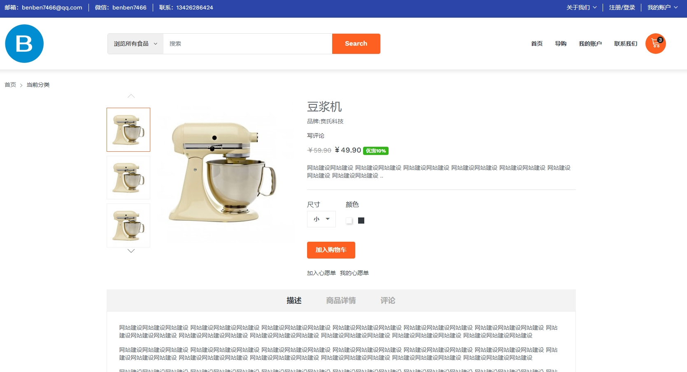
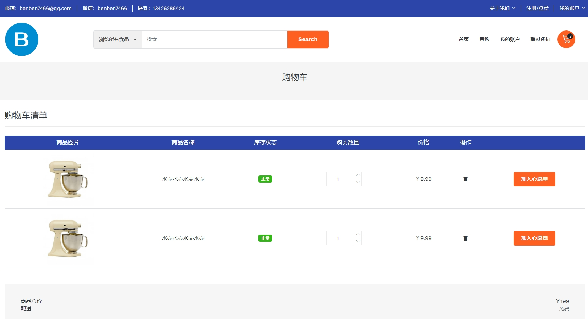

<div align="center">
  
  <h1>matrix-mall-web-vue3</h1>

  
  
  
  
  <a href="https://gitee.com/benben7466" target="_blank">
      
  </a>
</div>


## 项目简介

[matrix-mall-web-vue3](https://gitee.com/benben7466/matrix-mall-web-vue3) 是基于 Vue3 + Vite5+ TypeScript5 + Element-Plus + Pinia 等主流技术栈构建的免费开源的前台展示系统）

## 项目初衷

打造极简的企业级页面脚手架。


## 项目特色

- **简洁易用**：精简，无过渡封装 ，易上手。

- **基础设施**：动态路由、按钮权限、国际化、代码规范、常用组件封装。

- **持续更新**：项目持续开源更新，实时更新工具和依赖。
-
## 项目预览







## 项目启动

```bash
# 克隆代码
git clone https://gitee.com/benben7466/matrix-mall-web-vue3.git

# 切换目录
cd matrix-mall-web-vue3

# 安装依赖
yarn

# 启动运行
yarn dev --host
```

## 🌺 后端系统的展示工程
| Gitee | Github |
|-------|------|
| [MatrixMall-admin-web](https://gitee.com/benben7466/matrix-mall-admin-web)  | [MatrixMall-admin-web](https://github.com/benben7466/MatrixMall-admin-web)  |

## 🌺 后端系统的服务工程
| Gitee | Github |
|-------|------|
| [MatrixMall-admin-SpringBoot](https://gitee.com/benben7466/matrix-mall-admin-spring-boot)  | [MatrixMall-admin-SpringBoot](https://github.com/benben7466/MatrixMall-admin-SpringBoot)  |


## 交流与业务洽谈🚀
>
> 作者微信：benben7466，添加时请备注您的需求与目的。
>
> 如果需要业务洽谈，请访问官网：[贲氏工作室](http://benzhiqiang.w1.luyouxia.net/)，联系电话：134-2628-6424
> 